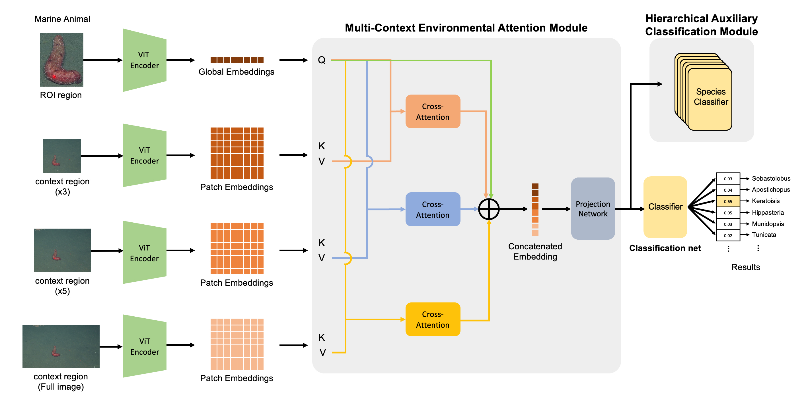

# Solution to the CVPR'2025 FGVC Challenge
This repository provides the solution(code and checkpoint) of the CVPR'2025 FathomNet-FGVC challenge.
[[FathomNet 2025 @ CVPR-FGVC]](https://www.kaggle.com/competitions/fathomnet-2025/overview)

## Our Model 

The proposed model is a visual recognition model designed to classify marine animals by considering not only the target object itself but also its surrounding habitat. As illustrated, the model takes as input both the region-of-interest (ROI) image of the marine animal extracted from the original image and additional context region images defined as 3×, 5×, and full-image scales centered on the ROI. Each input image is transformed into an embedding using a Vision Transformer (ViT). The marine animal ROI is represented by a global embedding derived from the [CLS] token, while the context region images are represented by patch embeddings.
These embeddings are then processed by the Multi-Context Environmental Attention Module (MCEAM), which infers attention-based interactions between the object and its surrounding environment at the context level. The resulting interactions are integrated to form a unified representation that captures both object-specific features and object-environment relationships. This integrated embedding is passed to a classifier to predict the marine animal's label.
To enhance semantic consistency in the model’s predictions, a Hierarchical Auxiliary Classification module is introduced during training. This auxiliary module performs classification across biological taxonomy levels (e.g., order, family, species), supporting the main classification task with a biologically informed hierarchical structure.


## Installation
(1) PyTorch. See https://pytorch.org/ for instruction. For example,
```
pip install torch==2.6.0 torchvision==0.21.0 torchaudio==2.6.0 --index-url https://download.pytorch.org/whl/cu124
```
(2) Requirements
```python
pip install -r requirements.txt
```

## Data
The dataset can be downloaded from the official challenge page on [[FathomNet 2025 @ CVPR-FGVC Data]](https://www.kaggle.com/competitions/fathomnet-2025/data).

## Data Preprocessing
```python
python A0.data_preprocess.py --data_path Path/to/dataset_train.json
```
The script generates the following files:
| File | Description |
|------|-------------|
| dist_categories.csv | Taxonomic distance matrix between categories based on the biological tree |
| hierarchical_label.csv | Hierarchical labels (Phylum to Species) for each class |

## Quick Start
## Train
To train the model from scratch, run the following command:
```python
python B1.BuildModel.py --config ./config/experiment-final06.yaml
```
## Checkpoint
Download the pretrained checkpoint from the [Google Drive link](https://drive.google.com/file/d/14cig7fanfNMsC2WFFBvbeuJMwYnogy8g/view?usp=sharing).
## Test
To evaluate the model or run inference on new data, use:
```python
python C1.TestModel.py --config ./config/experiment-final06.yaml
```
## Contact
If you have any questions, suggestions, or issues related to this project, feel free to reach out to me at:

rmsgml8689@gmail.com
